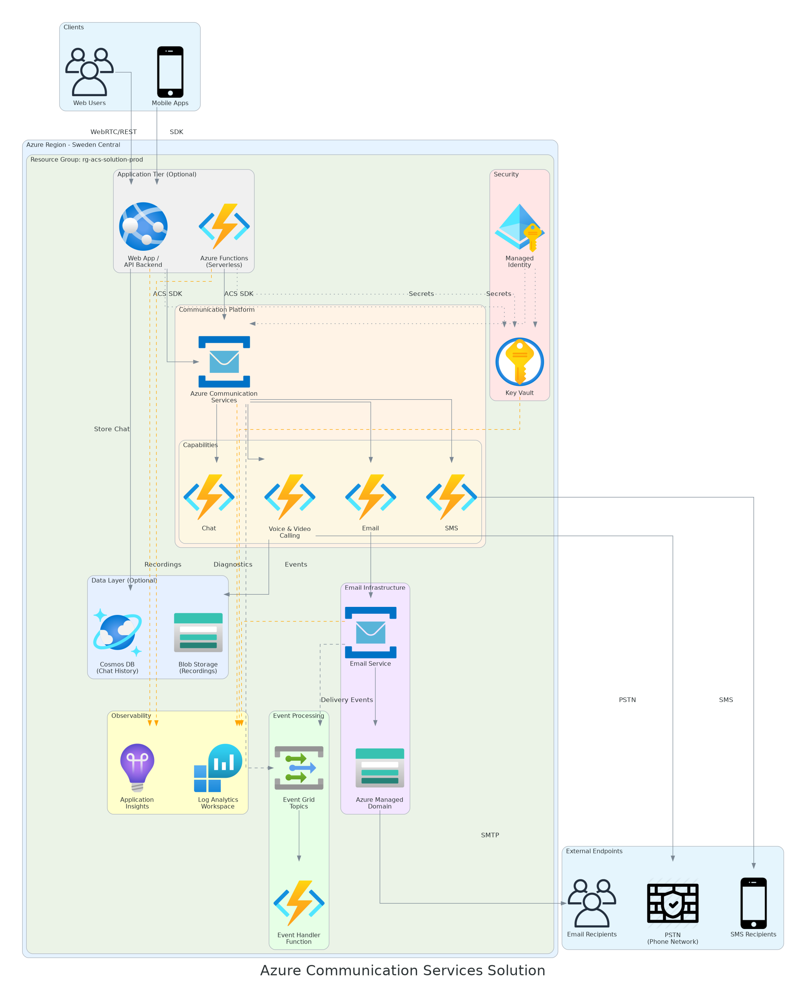

# Azure Communication Services Solution

> **Built with [Agentic InfraOps](https://github.com/jonathan-vella/azure-agentic-infraops)** - Azure infrastructure engineered by AI agents using GitHub Copilot.

## 💡 Original Request

*"I'm a partner solutions architect in infrastructure. Help me understand what Azure Communication Services is and walk me through building the basic solution using CAF, WAF, and Azure Landing Zones. Generate an architecture diagram, add additional capabilities, and create sample application code using the ACS SDK."*

---

This solution deploys a **Well-Architected** Azure Communication Services (ACS) infrastructure aligned with:

- ☁️ **Cloud Adoption Framework (CAF)** - Governance, naming conventions, tagging
- 🏗️ **Well-Architected Framework (WAF)** - Reliability, security, cost optimization
- 🏠 **Azure Landing Zones** - Resource organization, network topology

## 📋 Solution Components

| Component | Purpose | WAF Pillar |
|-----------|---------|------------|
| **Communication Services** | Core platform for voice, video, SMS, chat | All |
| **Email Service** | Transactional email capabilities | Reliability |
| **Log Analytics** | Centralized monitoring and diagnostics | Operational Excellence |
| **Key Vault** | Secure storage for connection strings | Security |
| **Event Grid** | Real-time event delivery (SMS reports, chat events) | Reliability |
| **Application Insights** | APM monitoring and distributed tracing | Operational Excellence |
| **Storage Account** | Call recordings and media storage | Reliability |

## 🏗️ Architecture




## 🚀 Quick Start

### Prerequisites

- Azure CLI 2.50+
- Bicep CLI (installed via `az bicep install`)
- Azure subscription with Contributor access

### Deploy

```bash
# Navigate to the solution directory
cd infra/bicep/acs-solution

# Deploy to development environment (interactive location selection)
pwsh ./deploy.ps1 -Environment dev

# Deploy to a specific location
pwsh ./deploy.ps1 -Environment dev -Location eastus

# Deploy to production
pwsh ./deploy.ps1 -Environment prod -Location westeurope
```

### What-If (Preview changes without deploying)

```bash
pwsh ./deploy.ps1 -Environment dev -WhatIf
```

### Cleanup (Delete Resources)

```bash
# Delete a specific environment
pwsh ./cleanup.ps1 -Environment dev

# Delete a specific resource group
pwsh ./cleanup.ps1 -ResourceGroupName rg-acs-solution-dev-001

# Delete all ACS solution resource groups (use with caution)
pwsh ./cleanup.ps1 -All

# Preview what would be deleted
pwsh ./cleanup.ps1 -WhatIf
```

## 📁 File Structure

```
acs-solution/
├── bicep/
│   ├── main.bicep              # Main orchestration template
│   ├── main.dev.bicepparam     # Development parameters
│   ├── main.prod.bicepparam    # Production parameters
├── deploy.ps1              # Deployment script
├── cleanup.ps1             # Resource cleanup script
├── README.md               # This file
├── modules/
│   ├── communication-services.bicep  # ACS resource
│   ├── email-service.bicep           # Email service + domains
│   ├── key-vault.bicep               # Secrets management
│   ├── log-analytics.bicep           # Monitoring
│   ├── store-secrets.bicep           # Store ACS secrets
│   ├── event-grid.bicep              # Event delivery
│   ├── app-insights.bicep            # Application monitoring
│   └── storage-account.bicep         # Media storage
└── samples/
    ├── README.md                     # Sample usage guide
    ├── python/                       # Python SDK samples
    │   └── acs_sample.py
    ├── dotnet/                       # .NET SDK samples
    │   ├── AcsSample.cs
    │   └── AcsSample.csproj
    └── typescript/                   # TypeScript SDK samples
        ├── acs-sample.ts
        ├── package.json
        └── tsconfig.json
```

## ⚙️ Configuration Parameters

| Parameter | Default | Description |
|-----------|---------|-------------|
| `baseName` | `acssoln` | Base name for all resources |
| `environment` | `dev` | Environment (dev/staging/prod) |
| `location` | `swedencentral` | Azure region for resources |
| `dataLocation` | `Europe` | Data residency location |
| `enableEmail` | `true` | Deploy email capabilities |
| `enableSms` | `true` | Enable SMS features |
| `enableDiagnostics` | `true` | Enable Log Analytics |
| `enableEventGrid` | `true` | Enable Event Grid for webhooks |
| `enableAppInsights` | `true` | Enable Application Insights |
| `enableCallRecording` | `false` | Enable call recording storage |

## 🔐 Security Features

- ✅ **RBAC-enabled Key Vault** - No access policies, pure Azure RBAC
- ✅ **Soft delete + Purge protection** - Prevent accidental secret deletion
- ✅ **Diagnostic logging** - All resources send logs to Log Analytics
- ✅ **Managed identities recommended** - Use MSI instead of connection strings
- ✅ **Tags for governance** - Environment, Owner, CostCenter tracking

## 💰 Cost Considerations

Azure Communication Services uses **pay-per-use** pricing:

| Capability | Pricing Model |
|------------|---------------|
| Voice calling | Per minute |
| Video calling | Per participant per minute |
| SMS | Per message segment |
| Email | Per message (first 100k free/month) |
| Chat | Per message |
| Phone numbers | Monthly fee + usage |

> 💡 **Tip**: Start with the free tier allowances for development/testing.

## 📊 Monitoring & Observability

All resources are configured to send diagnostics to Log Analytics:

```kusto
// Query ACS logs
ACSChatIncomingOperations
| where TimeGenerated > ago(24h)
| summarize count() by OperationName

// Query email delivery status
ACSEmailStatusUpdateOperational
| where TimeGenerated > ago(7d)
| summarize count() by DeliveryStatus
```

## 🔄 Post-Deployment Steps

### 1. Link Email Domain to Communication Services

```bash
# Get the domain resource ID
DOMAIN_ID=$(az communication email domain list \
  --email-service-name <email-service-name> \
  --resource-group <rg-name> \
  --query "[0].id" -o tsv)

# Link to ACS (not yet supported in CLI - use Azure Portal)
```

### 2. Provision Phone Numbers

```bash
# List available phone numbers
az communication phonenumber list-available \
  --connection-string "<acs-connection-string>" \
  --country-code US \
  --phone-number-type toll-free
```

### 3. Grant RBAC for Applications

```bash
# Grant Contributor role to a managed identity
az role assignment create \
  --assignee <managed-identity-principal-id> \
  --role "Contributor" \
  --scope <acs-resource-id>
```

## 📚 Additional Resources

- [Azure Communication Services Documentation](https://learn.microsoft.com/azure/communication-services/)
- [ACS Quickstarts](https://learn.microsoft.com/azure/communication-services/quickstarts/)
- [Azure Well-Architected Framework](https://learn.microsoft.com/azure/well-architected/)
- [Cloud Adoption Framework](https://learn.microsoft.com/azure/cloud-adoption-framework/)

## 💻 SDK Samples

This solution includes working sample applications in three languages:

| Language | Path | Features |
|----------|------|----------|
| **Python** | `samples/python/` | SMS, Email, Chat, Event Grid |
| **.NET** | `samples/dotnet/` | SMS, Email, Chat, Events |
| **TypeScript** | `samples/typescript/` | SMS, Email, Chat, Identity |

See [samples/README.md](samples/README.md) for setup instructions.

## 🖼️ Architecture Diagram

An architecture diagram is available at:
- Source: `docs/diagrams/acs-solution/architecture.py`
- Image: `docs/diagrams/acs-solution/acs_solution_architecture.png`

## 🤝 Contributing

See the repository's [CONTRIBUTING.md](../../../CONTRIBUTING.md) for guidelines.
